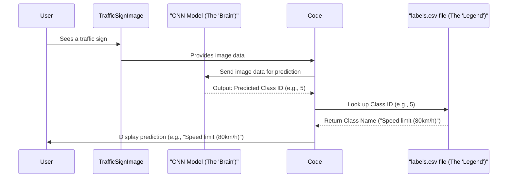

# Chapter 2: Traffic Sign Class ID Mapping

Welcome back! In the last chapter, [Traffic Sign Data](01_traffic_sign_data_.md), we explored the raw material for our project: the images of traffic signs and their associated labels. We saw that the system uses numbers (like 0, 1, 2...) to identify each type of sign.

But what do these numbers actually *mean*? If our system tells us it detected a sign with label '5', how do we know if that's a speed limit, a stop sign, or something else?

This is where the **Traffic Sign Class ID Mapping** comes in!

## What's the Problem? Numbers vs. Names

Imagine you're learning a new language, and you have a list of words, but instead of the English translation, you just have numbers next to them:

*   Apple: 0
*   Banana: 1
*   Cherry: 2

If someone tells you they found a '1', you wouldn't know what they mean unless you had the list. The number '1' is like the computer's internal label, but 'Banana' is the human-friendly name.

Our Traffic Sign Classification System faces the same challenge. The core machine learning model works with numerical IDs (0, 1, 2...). But for the system to be useful to a person (like showing the driver what sign was detected), it needs to translate that number back into a real-world name like "Speed limit (20km/h)" or "Stop".

## The Solution: The `labels.csv` File

The project uses a special file called `labels.csv` to act as our "legend" or "dictionary". This file contains a simple mapping: it lists each numerical ID and the corresponding human-readable name for that traffic sign class.

Think of it like this:

| ClassId | ClassName                 |
| :------ | :------------------------ |
| 0       | Speed limit (20km/h)      |
| 1       | Speed limit (30km/h)      |
| 2       | Speed limit (50km/h)      |
| ...     | ...                       |
| 43      | End of all speed limits or |

This table shows that `ClassId` is the number the system uses, and `ClassName` is what the sign is called in plain English.

## How is the Mapping Used? (The Core Use Case)

The main way this mapping is used is **after** the system has processed an image and predicted which traffic sign it is.

Here’s the simple idea:

1.  The system looks at a traffic sign image.
2.  It runs the image through its "brain" (the model).
3.  The "brain" outputs a number, for example, `5`.
4.  We then use the `labels.csv` file to look up what the number `5` corresponds to.
5.  The file tells us that `5` maps to "Speed limit (80km/h)".
6.  The system can now display "Speed limit (80km/h)" to the user.

This translation step makes the system's output understandable.

## Loading the Mapping into the Code

Just like we loaded the images and labels in Chapter 1, we need to load the `labels.csv` file into our program so the computer can use the mapping. The project uses a popular Python library called `pandas` to easily work with data like this, which is often stored in tables (like CSV files).

Look at this snippet from the code:

```python
import pandas as pd

labelFile = 'labels.csv' # The name of our mapping file
data = pd.read_csv(labelFile) # Use pandas to read the CSV file
print("data shape ", data.shape, type(data))
```

**Explanation:**

1.  `import pandas as pd`: This line brings in the `pandas` library, giving it the shorter name `pd` for convenience.
2.  `labelFile = 'labels.csv'`: This variable stores the name of the file we want to load.
3.  `data = pd.read_csv(labelFile)`: This is the core command. `pd.read_csv()` reads the content of `labels.csv` and stores it in a special format called a `DataFrame` (think of it as a smart table) within the `data` variable.
4.  `print(...)`: This line prints information about what was loaded. The output you saw in the notebook was `data shape (43, 2) <class 'pandas.core.frame.DataFrame'>`. This tells us `pandas` successfully loaded the file, found 43 rows (one for each traffic sign class, plus a header) and 2 columns, and stored it as a `pandas DataFrame`.

This short piece of code effectively loads our entire legend into the computer's memory, ready to be used.

## Using the Mapping (Conceptual Lookup)

Once the `labels.csv` data is loaded into the `data` DataFrame, looking up a class name from an ID is straightforward using `pandas`.

While the provided notebook snippet doesn't show the *exact* code for looking up a name *after* prediction, here's a simple example of how you *would* do that conceptually with the `data` DataFrame:

```python
# Assume 'data' is loaded from labels.csv as shown above
# And imagine the system just predicted class ID 5

predicted_class_id = 5

# Find the row where the 'ClassId' column equals our predicted ID (5)
# Then, from that row, get the value in the 'ClassName' column
# .iloc[0] is needed because the result might be a small list of matching names
class_name = data[data['ClassId'] == predicted_class_id]['ClassName'].iloc[0]

print(f"The system predicted sign ID: {predicted_class_id}")
print(f"This corresponds to: {class_name}")
```

**Explanation:**

This code snippet demonstrates the core lookup process. It filters the `data` DataFrame to find the row that matches the `predicted_class_id` (5 in this example) and then extracts the `ClassName` value from that matching row. The result would be "Speed limit (80km/h)".

## How it Works Under the Hood

Let's visualize the process of using this mapping from prediction to showing the result to a user.



This diagram shows the flow: the user sees a sign, the system processes it, the CNN Model outputs a number, the code uses the `labels.csv` mapping to turn the number into a name, and finally, the user sees the understandable name.

The code handles the interaction between the model's numerical output and the human-readable mapping file using libraries like `pandas` to make the lookup efficient.

## Why is This Step Important?

Without this mapping, the system's predictions (just numbers) would be meaningless to anyone using the system. The `labels.csv` file and the code to load and use it provide the necessary translation layer, making the output useful and actionable. It connects the internal workings of the computer model to the real world of traffic signs that humans understand.

## Conclusion

In this chapter, we learned about the vital **Traffic Sign Class ID Mapping**. We understood why it's necessary to translate the numerical labels used by the computer model into human-readable names. We saw that the `labels.csv` file holds this important legend and got a glimpse of how the system loads this data using `pandas` and conceptually uses it for translation.

Now that we understand how to interpret the numerical labels, the next step is to delve deeper into how the system takes the raw image data and prepares it for the "brain" (the CNN model) to understand. This involves loading the data in a specific way.

Let's move on to the next chapter to learn about loading the dataset properly!

[Dataset Loader](03_dataset_loader_.md)

---
