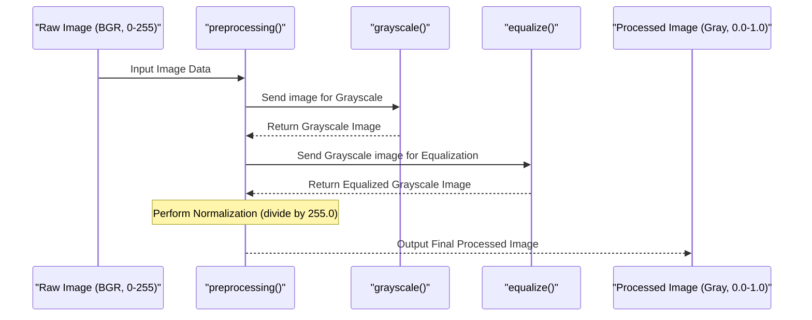

# Chapter 4: Data Preprocessor

Welcome back! In the last chapter, [Dataset Loader](03_dataset_loader_.md), we successfully loaded all our traffic sign images and their corresponding labels from the file system into organized NumPy arrays. We have our raw material: a large collection of images represented as grids of pixel numbers.

Now, imagine you're teaching someone to identify fruits. You'd show them pictures of apples, bananas, etc. But what if some apple pictures were taken in bright sunlight (very light) and others in dim light (very dark)? What if some were in color and others in black and white? The person might get confused!

Similarly, the raw image data we loaded has variations. Some pictures might be brighter or darker than others, or have slightly different colors depending on the camera or lighting conditions when they were taken. Our computer model, which is learning from these numbers, can also get confused by these inconsistencies.

This is where the **Data Preprocessor** comes in!

## What is the Data Preprocessor?

The Data Preprocessor is like a special preparation step for our image ingredients. It takes the raw image data and transforms it into a standardized format. This standardization helps the computer model focus on the important features of the traffic sign (like its shape and key symbols) rather than getting distracted by things like lighting variations or color differences.

Think of it as cleaning, chopping, and measuring all your recipe ingredients precisely before you start cooking. Everyone gets the same amount of perfectly prepared ingredients, no matter where they came from.

The Data Preprocessor in this project performs three main tasks on each image:

1.  **Convert to Grayscale:** Changes color images to black and white.
2.  **Adjust Brightness/Contrast (Equalize Histogram):** Makes the distribution of light and dark pixels more uniform across all images.
3.  **Normalize Pixel Values:** Scales the pixel values to a small, consistent range (like between 0 and 1).

Let's look at why these steps are important and how the code implements them.

## Step 1: Grayscale Conversion

**Why:** Our raw images are in color (3 color channels: Red, Green, Blue). Converting them to grayscale means we only deal with one channel representing brightness. This significantly reduces the amount of data the model needs to process for each image, making training faster and potentially helping the model learn more effectively by focusing on shapes and patterns rather than specific colors (though for traffic signs, color *is* important, sometimes grayscale still helps simplify the problem).

**How (in code):** The OpenCV library (`cv2`) has a function specifically for this.

```python
import cv2 # Need OpenCV for image operations

def grayscale(img):
    # cv2.COLOR_BGR2GRAY is a code telling OpenCV to convert from Blue-Green-Red
    # (OpenCV's default color order) to Grayscale.
    img = cv2.cvtColor(img, cv2.COLOR_BGR2GRAY)
    return img
```

**Explanation:** This small function takes an image (as a NumPy array) and uses `cv2.cvtColor` to change its color space to grayscale. It then returns the modified image array.

## Step 2: Adjust Brightness/Contrast (Equalize Histogram)

**Why:** Images taken in different lighting conditions can vary greatly in brightness and contrast. A dark image might have most pixel values clustered at the low end of the scale, while a bright image has them clustered at the high end. This variation can make it harder for the model to recognize the same sign in different photos. Equalizing the histogram spreads out these pixel values, enhancing contrast and making details more visible, and importantly, making the *overall look* of the image more consistent with other images in the dataset.

**How (in code):** OpenCV also has a function for this.

```python
import cv2 # Still need OpenCV

def equalize(img):
    # cv2.equalizeHist calculates and applies the histogram equalization.
    # This function works best on single-channel images (like grayscale).
    img = cv2.equalizeHist(img)
    return img
```

**Explanation:** This function takes a grayscale image and applies histogram equalization using `cv2.equalizeHist`. This function automatically calculates how to best adjust the brightness and contrast to make the pixel distribution more even.

## Step 3: Normalizing Pixel Values

**Why:** Raw pixel values are typically integers ranging from 0 to 255 (for 8-bit images). Neural networks often perform better when input values are scaled to a smaller, consistent range, such as between 0.0 and 1.0. This helps the mathematical calculations within the network run more smoothly and efficiently during training.

**How (in code):** This is a simple arithmetic operation. We can do this right after equalizing.

```python
# This step is usually combined with other preprocessing
# After converting to grayscale and equalizing (pixel values are still 0-255)
# ... add this line ...
img = img / 255.0 # Divide every pixel value by 255.0 to scale it between 0 and 1
```

**Explanation:** By dividing every pixel's brightness value (which is between 0 and 255) by 255.0 (using a float `255.0` ensures the result is a float), we scale the entire image's pixel values into the range [0.0, 1.0].

## The Combined Preprocessing Function

The project's code combines these steps into one main `preprocessing` function.

```python
import cv2 # Still need OpenCV

def grayscale(img):
    img = cv2.cvtColor(img, cv2.COLOR_BGR2GRAY)
    return img

def equalize(img):
    img = cv2.equalizeHist(img)
    return img

def preprocessing(img):
    # Step 1: Convert to Grayscale
    img = grayscale(img)
    # Step 2: Adjust Brightness/Contrast (Equalize Histogram)
    img = equalize(img)
    # Step 3: Normalize Pixel Values (Scale from 0-255 to 0-1)
    img = img / 255.0
    return img
```

**Explanation:** The `preprocessing` function takes a single raw image (color, 0-255 pixel values), applies the `grayscale` function, then the `equalize` function, and finally divides all pixel values by 255.0 before returning the completely processed image.

## Applying the Preprocessor to All Images

In [Dataset Loader](03_dataset_loader_.md), we loaded all images into a NumPy array called `images`. To preprocess the *entire* dataset, we need to apply the `preprocessing` function to every single image in this array. The code uses Python's `map` function combined with `numpy.array` to do this efficiently.

While the original code applies preprocessing *after* splitting (which we'll cover in the next chapter, [Dataset Splitter](05_dataset_splitter_.md)), conceptually, the preprocessing step happens *before* the model sees the data. To follow our tutorial structure, let's show how it would apply to the full `images` array (even though the code applies it to `X_train`, `X_validation`, `X_test` arrays separately after the split).

```python
# Assuming 'images' is the NumPy array loaded from the Dataset Loader
# This line applies the 'preprocessing' function to EACH image in the 'images' array
# 'list(map(preprocessing, images))' creates a list of the processed images
# 'np.array(...)' converts that list back into a NumPy array
processed_images = np.array(list(map(preprocessing, images)))

# Now, 'processed_images' contains all the images,
# but they are grayscale, equalized, and normalized.
```

**Explanation:** This line is powerful. It takes the `images` array (which contains all our raw images), iterates through each image, applies the `preprocessing` function to it, collects the results into a list, and then converts that list back into a NumPy array called `processed_images`. This `processed_images` array is now ready for the next steps, like splitting.

## How it Works Under the Hood (for one image)

Let's visualize the journey of a single raw image through the `preprocessing` function:



This diagram shows how one image enters the `preprocessing` function and goes through the sequence of steps – grayscale, equalization, and normalization – to become a standardized, processed image.

## Why is This Step Important?

The Data Preprocessor is vital because it ensures consistency. By transforming all images into a uniform format (grayscale, consistent contrast, normalized pixel values), we provide the computer model with data that is easier to learn from. This often leads to better training results and a more accurate classification system. It helps the model generalize well, meaning it can recognize traffic signs even if they look slightly different (due to lighting, etc.) from the ones it was trained on.

## Conclusion

In this chapter, we learned about the **Data Preprocessor**. We understood why raw image data needs preparation for a computer model and explored the three key steps involved: converting to grayscale, equalizing brightness and contrast, and normalizing pixel values. We saw the Python code functions (`grayscale`, `equalize`, and `preprocessing`) that perform these tasks using the OpenCV library and how these functions are applied to the dataset.

Now that our images are loaded and nicely prepared, the next logical step is to divide this prepared data into different groups for training, validation, and testing.

Ready to learn how we split the data? Let's move on to the next chapter!

[Dataset Splitter](05_dataset_splitter_.md)

---
