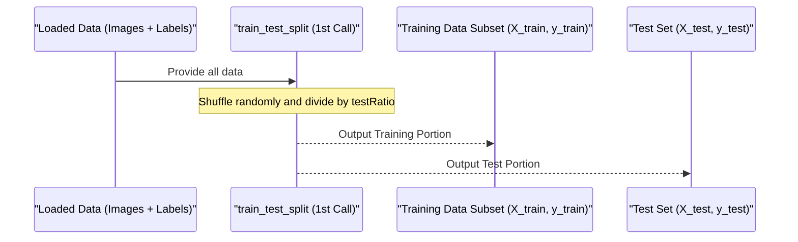
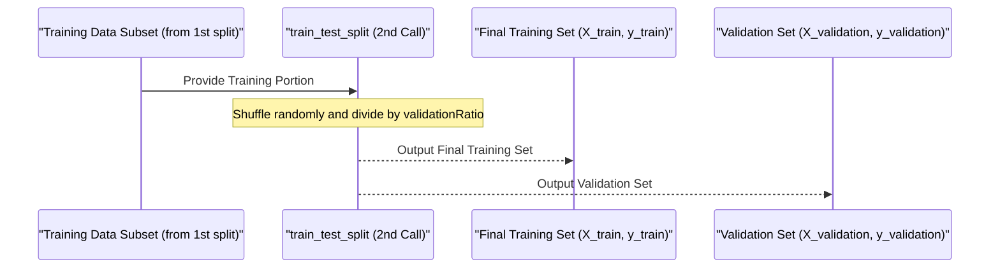

# Chapter 5: Dataset Splitter

Welcome back! In our journey to build a Traffic Sign Classification System, we've covered some important ground:
*   In [Chapter 1: Traffic Sign Data](01_traffic_sign_data_.md), we understood the raw material: images and their numerical labels.
*   In [Chapter 2: Traffic Sign Class ID Mapping](02_traffic_sign_class_id_mapping_.md), we learned how to translate those numbers into human-readable traffic sign names.
*   In [Chapter 3: Dataset Loader](03_dataset_loader_.md), we saw how to load all these images and labels from files into organized arrays.
*   In [Chapter 4: Data Preprocessor](04_data_preprocessor_.md), we prepared the raw image data by converting to grayscale, equalizing brightness, and normalizing pixel values, making it more consistent and easier for a model to learn from.

Now we have a large collection of beautifully prepared images and their corresponding labels. The data looks good, but it's all in one big pile. If we just used *all* this data to teach our computer model, how would we know if it actually learned to recognize signs or just memorized the pictures it saw?

This is the core problem the **Dataset Splitter** solves!

## What is the Dataset Splitter?

Imagine you are a teacher preparing students for a big exam. You wouldn't just give them *all* the study material and then test them using the *exact same* questions they studied. Why? Because they might just memorize the answers without truly understanding the concepts.

A good teacher would:

1.  Give the students some material to **study** from (Training Data).
2.  Give them some **practice tests** along the way to check their understanding and see what they need to work on (Validation Data).
3.  Give them a **final exam** with entirely new questions to see how well they can apply what they learned to unseen problems (Test Data).

The Dataset Splitter does exactly this for our computer model! It takes our single large dataset and divides it into three distinct groups:

1.  **Training Set:** This is the largest part of the data. The computer model will "study" these images and labels to learn the patterns and features that define each traffic sign class.
2.  **Validation Set:** During the training process, we periodically check the model's performance on this set. It's like a practice test. This helps us monitor if the model is learning effectively and not just memorizing the training data. It also helps us tune the training process.
3.  **Test Set:** This set is completely held back until the very end, *after* the model has finished training and any tuning. It's like the final exam. We use it once to get a final, unbiased evaluation of how well our model is likely to perform on brand-new traffic sign images it has never seen before.

## Why is Splitting So Important?

Splitting the data is crucial for several reasons:

*   **Prevents Overfitting:** Overfitting happens when a model learns the training data *too well*, memorizing noise or specific details that aren't generalizable. This is like a student memorizing test answers but not understanding the subject. An overfit model performs poorly on new, unseen data. The validation and test sets help us detect and prevent this.
*   **Provides Unbiased Evaluation:** The test set gives us a realistic measure of how well the model will perform "in the real world" on data it hasn't encountered during learning.
*   **Helps Tune the Model:** The validation set helps us make decisions *during* training or model development (like how long to train or which parameters to use) without touching the final test set.

## How the System Splits the Data

The project uses a common and very useful tool from the `scikit-learn` library (often abbreviated as `sklearn`) called `train_test_split`. This function is designed specifically for this task.

The notebook code performs the split in two steps to create the three sets:

1.  **First Split: Data vs. Test Set:** It first splits the entire dataset (all loaded images and labels) into a large portion for "training data" and a smaller portion for the final "test set".
2.  **Second Split: Training Data vs. Validation Set:** It then takes the larger "training data" portion from the first step and splits *that* into the actual "training set" (for the model to learn from) and the "validation set" (for practice tests during training).

Let's look at the code snippet from the notebook that does this:

```python
from sklearn.model_selection import train_test_split # Import the function

# ... (previous code loads images and classNo NumPy arrays) ...

testRatio = 0.2    # Percentage of data to use for the Test Set (20%)
validationRatio = 0.2 # Percentage of the REMAINING data for the Validation Set (20%)

# --- First Split: images + classNo --> X_train, X_test, y_train, y_test ---
# Split the original images and classNo. 20% goes to test set.
X_train, X_test, y_train, y_test = train_test_split(images, classNo, test_size=testRatio)

# --- Second Split: X_train, y_train --> X_train, X_validation, y_train, y_validation ---
# Split the result of the FIRST split. 20% of THIS portion goes to validation set.
X_train, X_validation, y_train, y_validation = train_test_split(X_train, y_train, test_size=validationRatio)

# Now we have:
# X_train: Images for training
# y_train: Labels for training
# X_validation: Images for validation
# y_validation: Labels for validation
# X_test: Images for testing
# y_test: Labels for testing
```

**Explanation:**

*   `from sklearn.model_selection import train_test_split`: This line imports the necessary function.
*   `testRatio = 0.2`: We define a variable `testRatio` to specify that 20% of the *original* data should be set aside for the test set.
*   `validationRatio = 0.2`: We define `validationRatio` to specify that 20% of the data *remaining after* the test split will be used for validation.
*   `train_test_split(images, classNo, test_size=testRatio)`: This is the first call. It takes the full `images` array and `classNo` array. It randomly shuffles them and splits them based on `test_size=0.2`. It returns two pairs of arrays: `X_train` (80% of images) and `y_train` (80% of labels), and `X_test` (20% of images) and `y_test` (20% of labels).
*   `train_test_split(X_train, y_train, test_size=validationRatio)`: This is the second call. It takes the *result* of the first split (`X_train` and `y_train` which currently hold 80% of the data). It then splits *this 80% portion* again. 20% of this 80% is set aside for the validation set (`X_validation`, `y_validation`), and the remaining 80% of this 80% becomes the final training set (`X_train`, `y_train`).

This two-step process is a common way to get training, validation, and test sets from a single dataset.

## Looking at the Data Shapes After Splitting

The output you saw in Chapter 1 actually showed the shapes *after* this splitting process:

```
Data Shapes
Train(22271, 32, 32, 3) (22271,)
Validation(5568, 32, 32, 3) (5568,)
Test(6960, 32, 32, 3) (6960,)
```

Let's break down these numbers based on the original total number of images loaded. Although the exact total count wasn't explicitly printed *before* the split in the output shown, the code snippet *does* load the data first. Let's assume the total number of images loaded was `22271 + 5568 + 6960 = 34799`.

*   **Test Split:** The first split takes 20% for the test set. `34799 * 0.2 = 6959.8`, which is approximately 6960. So, the `Test` set has 6960 images and 6960 labels.
    *   Remaining data: `34799 - 6960 = 27839`
*   **Validation Split:** The second split takes 20% of the *remaining* data (27839) for the validation set. `27839 * 0.2 = 5567.8`, which is approximately 5568. So, the `Validation` set has 5568 images and 5568 labels.
*   **Training Set:** The rest of the data goes to the training set. `27839 - 5568 = 22271`. So, the `Train` set has 22271 images and 22271 labels.

These numbers match the shapes shown in the output, confirming how the data was split according to the specified ratios. Each image array has the shape `(number_of_images, 32, 32, 3)`, indicating the count, height, width, and 3 color channels (this shape will change slightly *after* preprocessing, as seen later in the notebook, but the *number of images* in each split remains fixed here). The label arrays have the shape `(number_of_images,)`, indicating a single label number for each image.

## How it Works Under the Hood (Conceptual)

The `train_test_split` function, at a high level, does the following for each split:

1.  **Pair Data:** It keeps each image tightly linked to its correct label.
2.  **Shuffle:** It randomly shuffles the combined image/label pairs. This is important to ensure that images from different classes are distributed throughout the dataset, preventing any bias that might arise if, for example, all the 'Stop Sign' images were at the beginning.
3.  **Divide:** It then divides the shuffled pairs into the requested proportions based on the `test_size` (or `validation_size`).

Here's a simple diagram for the first split:



And then the second split:



This two-step process ensures that the test set is truly separate and unseen during training and validation.

## The Dataset is Now Split!

After the code runs this section, we have our data neatly divided into three sets: `X_train`, `X_validation`, `X_test` containing the image data, and `y_train`, `y_validation`, `y_test` containing the corresponding labels.

It's important to note that the splitting happens *before* the preprocessing step in the provided notebook code. While conceptually preprocessing happens before the model *sees* the data, applying the split first ensures that the preprocessing is applied *separately* to each set. This prevents any subtle data leakage where information from the test or validation set might inadvertently influence the preprocessing applied to the training set.

## Conclusion

In this chapter, we learned about the essential **Dataset Splitter**. We understood why dividing our data into training, validation, and test sets is critical for building a robust machine learning model and preventing overfitting. We saw how the `train_test_split` function from `scikit-learn` is used in the project to perform this split in two steps, creating our three distinct datasets. We also saw how the sizes of these sets reflect the splitting ratios used.

Now that our data is loaded, preprocessed, and split, we have the fundamental ingredients ready. However, training a deep learning model like a CNN often benefits from having *even more* variations of the training images. This is where the next step, Image Data Generation, comes in.

Ready to make our training set even richer? Let's move on to the next chapter!

[Image Data Generator](06_image_data_generator_.md)

---
