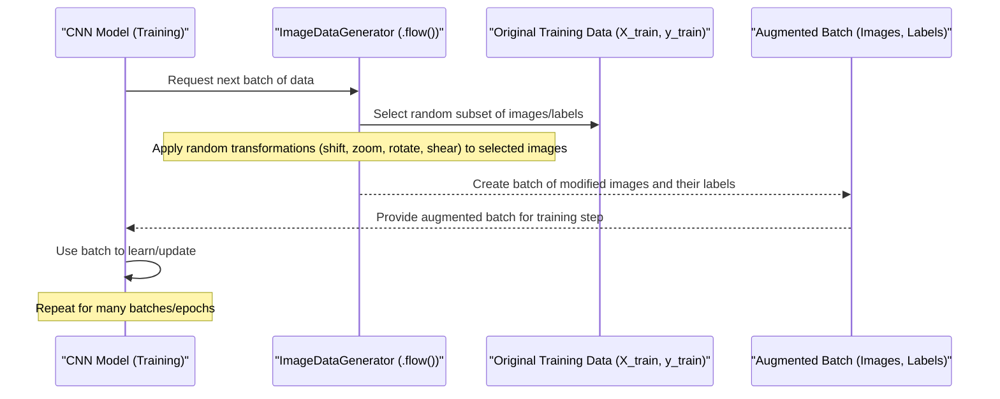

# Chapter 6: Image Data Generator

Welcome back! So far in our traffic sign classification journey, we've done a lot of preparation:
*   We understood the raw [Traffic Sign Data](01_traffic_sign_data_.md).
*   We learned how to use [Traffic Sign Class ID Mapping](02_traffic_sign_class_id_mapping_.md) to translate numerical labels.
*   We used the [Dataset Loader](03_dataset_loader_.md) to get all the image data into our program.
*   We applied the [Data Preprocessor](04_data_preprocessor_.md) to make the images consistent (grayscale, equalized, normalized).
*   We used the [Dataset Splitter](05_dataset_splitter_.md) to divide our data into training, validation, and test sets.

Now we have our nicely prepared data split into three groups. The training set contains thousands of images ready to teach our computer model.

However, even with thousands of images, a computer model learning to recognize traffic signs can sometimes become *too* specialized in recognizing the *exact* images it was trained on. If it sees a sign that's slightly tilted, a little bit zoomed in, or shifted to the side compared to the training examples, it might get confused.

This is a common problem in machine learning called **overfitting**. It's like teaching someone to recognize your dog, but only showing them pictures where the dog is sitting perfectly still in the living room. They might not recognize the dog when it's running in the park!

How can we help our model learn to recognize traffic signs even if they look a little different? We need to show it more variations!

## What is the Image Data Generator?

The **Image Data Generator** is a powerful tool that helps us solve the overfitting problem by creating *new, slightly altered versions* of our existing training images *on the fly* during the training process. It doesn't actually save all these new images to your disk (which would take up huge amounts of space!). Instead, it generates batches of these modified images as the model needs them.

Think of it as having a photographer who takes your training images and, for every training step, quickly generates a few slightly different versions of the same picture – one rotated a bit, one zoomed in, one shifted, etc. The model then trains on these constantly changing variations.

This process is called **Data Augmentation**. By training on augmented data, the model learns to be more robust and recognize the key features of a traffic sign regardless of minor variations in its appearance or position.

## How it Works: Random Transformations

The `ImageDataGenerator` applies random transformations to the images. The code snippet in the project uses several common and effective transformations for image tasks:

*   **`width_shift_range` / `height_shift_range`:** Randomly shifts the image horizontally or vertically.
    *   *Analogy:* A sign might not be perfectly centered in the camera's view.
    *   *Code:* `width_shift_range=0.1` means shifting horizontally by up to 10% of the image width. `height_shift_range=0.1` is similar for vertical shifts.
*   **`zoom_range`:** Randomly zooms in or out on the image.
    *   *Analogy:* The car might be closer or further from the sign, making it appear larger or smaller.
    *   *Code:* `zoom_range=0.2` means zooming by up to 20%.
*   **`shear_range`:** Applies a shearing transformation, which is like tilting the image.
    *   *Analogy:* A sign might be viewed from a slight angle.
    *   *Code:* `shear_range=0.1` applies a shear transformation up to a certain angle (0.1 radians).
*   **`rotation_range`:** Randomly rotates the image by a specified degree range.
    *   *Analogy:* The camera might be slightly tilted, or the sign itself might not be perfectly straight.
    *   *Code:* `rotation_range=10` means rotating randomly between -10 and +10 degrees.

Each time the generator provides a batch of images for training, it takes original images from the training set and applies a *different random combination* of these transformations to each image in the batch.

## Using Image Data Generator in Code

The project uses the `ImageDataGenerator` class from `keras.preprocessing.image`.

First, you import the class:

```python
from keras.preprocessing.image import ImageDataGenerator
```

Then, you create an instance of the generator and specify the types and ranges of transformations you want to apply:

```python
dataGen= ImageDataGenerator(width_shift_range=0.1,
                            height_shift_range=0.1,
                            zoom_range=0.2,
                            shear_range=0.1,
                            rotation_range=10)
```

**Explanation:** This line creates a `dataGen` object that is configured to perform the specified random shifts, zoom, shear, and rotation.

Before we can use the generator, our grayscale images (from [Data Preprocessor](04_data_preprocessor_.md)) need to be reshaped slightly. They are currently `(height, width)`, but Keras models and the generator expect image data to have a channel dimension, even if it's just one channel for grayscale. We reshape them to `(height, width, 1)`. This happens right before the generator setup in the notebook code.

```python
# Assuming X_train, X_validation, X_test are the preprocessed grayscale arrays
# These arrays currently have shape (num_images, height, width)
# We need to add a channel dimension for Keras and the generator

X_train = X_train.reshape(X_train.shape[0], X_train.shape[1], X_train.shape[2], 1)
X_validation = X_validation.reshape(X_validation.shape[0], X_validation.shape[1], X_validation.shape[2], 1)
X_test = X_test.reshape(X_test.shape[0], X_test.shape[1], X_test.shape[2], 1)

# Now shapes are (num_images, height, width, 1)
```

**Explanation:** The `.reshape()` method changes the shape of the NumPy array. We keep the number of images, height, and width the same, but add a new dimension of size 1 at the end to represent the single grayscale channel.

Next, we "fit" the generator. For simple geometric transformations like the ones used here, the `fit` method mainly does some internal setup. If we were using transformations like centering or standardization based on the training data statistics, `fit` would calculate those statistics here.

```python
# 'Fit' the generator on the training data
dataGen.fit(X_train)
```

**Explanation:** This line prepares the `dataGen` object to work with the `X_train` data.

Finally, we use the `.flow()` method to create the actual data generator that will be used during training. This method tells the generator *which* data to use (`X_train`, `y_train`) and *how* to provide it (in batches of a certain size).

```python
# Create a generator that yields batches of augmented images and labels
batches = dataGen.flow(X_train, y_train, batch_size=32) # Using a batch size of 32 as defined earlier

# 'batches' is now an object that we can use to get augmented data batches
```

**Explanation:** `dataGen.flow()` creates a generator object named `batches`. When the model trains, it will ask `batches` for a batch of data. `batches` will then randomly select some images from `X_train` and their corresponding labels from `y_train`, apply the random transformations specified earlier, and return a batch of 32 augmented images and their labels.

It's important to note that the labels (`y_train`) are converted into a format suitable for our model's output layer and loss function (`categorical_crossentropy`). This happens *before* creating the `batches` generator:

```python
from keras.utils.np_utils import to_categorical

# Convert labels (single numbers) to one-hot encoded format (vectors)
# Example: label 5 becomes [0, 0, 0, 0, 0, 1, 0, ..., 0] for 43 classes
y_train = to_categorical(y_train, noOfClasses)
y_validation = to_categorical(y_validation, noOfClasses)
y_test = to_categorical(y_test, noOfClasses)
```

**Explanation:** `to_categorical` transforms each numerical label into a vector where only the position corresponding to the class number is 1, and the rest are 0. This is the standard format for classification labels when using the `categorical_crossentropy` loss function. The `batches` generator will yield images and their labels in this one-hot encoded format.

## How it Works Under the Hood (During Training)

Let's visualize what happens when the model is training and needs a batch of data from the generator:



This diagram shows that the generator doesn't pre-calculate everything. It waits for the model to ask for data and then generates a fresh batch with new random variations each time. This makes the training data effectively much larger and more diverse.

## Why is This Step Important?

Using the Image Data Generator is extremely beneficial for training robust image classification models, especially when your dataset size is limited. It helps the model:

*   **See More Data:** It artificially increases the size and variety of the training dataset.
*   **Reduce Overfitting:** By training on varied examples, the model learns to ignore minor distractions and focus on the core features of a sign, making it less likely to overfit to specific images.
*   **Improve Generalization:** The model becomes better at recognizing signs in real-world conditions where they might not look exactly like the perfect training examples.

The validation and test sets (from [Dataset Splitter](05_dataset_splitter_.md)) are *not* passed through the `ImageDataGenerator`. They are used as is, because we want to evaluate the model on realistic, unaltered data. Data augmentation is typically only applied to the training set.

## Conclusion

In this chapter, we learned about the powerful **Image Data Generator**. We understood that it helps prevent overfitting and improves the model's ability to generalize by creating random variations of training images on the fly. We explored the types of transformations it applies (shifts, zoom, shear, rotation) and saw the basic code to configure and use it with our preprocessed and reshaped training data.

Now that our data is fully prepared and augmented, we have everything ready for the "brain" of our system: the Convolutional Neural Network model itself.

Ready to build the model that will learn to classify the signs? Let's move on to the next chapter!

[Convolutional Neural Network (CNN) Model](07_convolutional_neural_network__cnn__model_.md)

---
