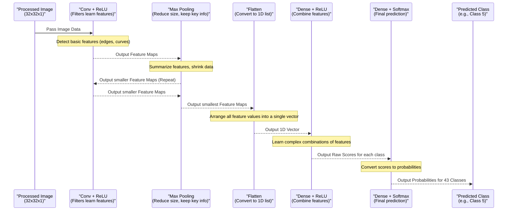

# Chapter 7: Convolutional Neural Network (CNN) Model

Welcome back! We've come a long way in preparing our data:
*   We started with raw image files ([Traffic Sign Data](01_traffic_sign_data_.md)).
*   We learned what the labels mean ([Traffic Sign Class ID Mapping](02_traffic_sign_class_id_mapping_.md)).
*   We loaded everything into the computer ([Dataset Loader](03_dataset_loader_.md)).
*   We cleaned and standardized the images ([Data Preprocessor](04_data_preprocessor_.md)).
*   We split the data into sets for learning and testing ([Dataset Splitter](05_dataset_splitter_.md)).
*   And we even created more variations of our training images to help the model generalize better ([Image Data Generator](06_image_data_generator_.md)).

Now that our data is perfectly prepared, it's time to build the "brain" of our traffic sign classification system! This brain needs to take an image as input and figure out *which* of the 43 traffic signs it is.

For tasks involving images, a specific type of artificial neural network called a **Convolutional Neural Network (CNN)** is the standard and most powerful tool.

## What is a Convolutional Neural Network (CNN)?

Imagine you're trying to teach someone to recognize different objects, like chairs, tables, or cars. You wouldn't just tell them "A chair has these exact pixel colors at these exact spots." Instead, you'd point out *features*: "See? This has legs, a seat, and a back." "This one has wheels, windows, and headlights." You teach them to look for specific patterns and shapes.

A CNN works in a similar way for images. Instead of looking at individual pixels directly, it uses special layers to automatically learn and detect features within images. It starts by looking for simple features like edges and curves in the early layers, then combines these to find more complex features like shapes, symbols, and patterns in later layers. Finally, based on all the detected features, it makes a decision about what object is in the image.

The CNN model in our project is a network built from different types of layers stacked together, specifically designed to process the images of traffic signs we've prepared.

## The Building Blocks: Layers in a CNN

Our CNN is constructed by stacking several types of layers. Think of each layer as a step in the process of understanding the image:

| Layer Type          | What it does                                         | Analogy                                     |
| :------------------ | :--------------------------------------------------- | :------------------------------------------ |
| **Convolutional**   | Detects features (edges, textures, patterns) using filters. | Feature detectors (like finding all circles or lines) |
| **Pooling (Max Pooling)** | Reduces the size of the image data, keeping the most important features. | Summarizing information, keeping key points |
| **Flatten**         | Converts the 2D/3D image data into a 1D list of numbers. | Unrolling a picture into a single line |
| **Dense (Fully Connected)** | Uses the detected features (the 1D list) to make the final classification. | The decision-making part, looking at all gathered info |

Our model will stack combinations of these layers.

## Building the Model in Code

We'll use the Keras library (which is part of TensorFlow) to build our CNN. Keras makes it easy to define models layer by layer. The model definition is handled within a function called `myModel()` in the project's code.

Let's look at the code that defines the model, breaking it down piece by piece:

```python
from keras.models import Sequential
from keras.layers import Dense, Dropout, Flatten
from keras.layers.convolutional import Conv2D, MaxPooling2D

def myModel():
    # 1. Start building a sequential model (layers stacked one after another)
    model= Sequential()

    # ... layers will be added here ...

    # 7. Compile the model (prepare it for training)
    model.compile(Adam(lr=0.001),loss='categorical_crossentropy',metrics=['accuracy'])

    return model
```

**Explanation:**

*   We import the necessary classes from Keras. `Sequential` is the simplest way to build a model by stacking layers. `Dense`, `Dropout`, `Flatten`, `Conv2D`, and `MaxPooling2D` are the types of layers we'll use.
*   The `myModel()` function will contain the definition of our CNN architecture.
*   `model = Sequential()` creates an empty model ready to have layers added.
*   `model.compile(...)` sets up the learning process. We'll explain this when we cover [Model Training Process](08_model_training_process_.md), but know that this line prepares the model to be trained.

Now let's add the layers inside the `myModel()` function:

```python
def myModel():
    model= Sequential()
    imageDimesions = (32,32,1) # Our images are 32x32 pixels, 1 channel (grayscale)

    # 2. Add the first Convolutional Layer
    model.add((Conv2D(60,(5,5),input_shape=imageDimesions,activation='relu')))
    # 3. Add another Convolutional Layer
    model.add((Conv2D(60, (5,5), activation='relu')))
    # 4. Add a Pooling Layer
    model.add(MaxPooling2D(pool_size=(2,2)))

    # 5. Add more Convolutional and Pooling Layers to learn more complex features
    model.add((Conv2D(30, (3,3),activation='relu')))
    model.add((Conv2D(30, (3,3), activation='relu')))
    model.add(MaxPooling2D(pool_size=(2,2)))
    # 6. Add a Dropout Layer (helps prevent overfitting)
    model.add(Dropout(0.5)) # Randomly turn off 50% of neurons during training

    # 7. Flatten the output for the Dense layers
    model.add(Flatten())
    # 8. Add a Dense (Fully Connected) Layer
    model.add(Dense(500,activation='relu'))
    # 9. Add another Dropout Layer
    model.add(Dropout(0.5))
    # 10. Add the final Output Layer
    noOfClasses = 43 # We know there are 43 different signs
    model.add(Dense(noOfClasses,activation='softmax'))

    # 11. Compile the model (prepare it for training)
    model.compile(Adam(lr=0.001),loss='categorical_crossentropy',metrics=['accuracy'])

    return model
```

**Explanation of the Layers:**

*   **`Conv2D(60, (5,5), input_shape=imageDimesions, activation='relu')`:**
    *   `Conv2D`: This is a 2D convolutional layer, used for image data.
    *   `60`: This is the number of filters it uses. Each filter learns to detect a different feature. Having 60 filters means this layer will look for 60 different types of patterns.
    *   `(5,5)`: This is the size of the filter (or kernel). A 5x5 filter scans a 5x5 pixel area of the image at a time.
    *   `input_shape=imageDimesions`: **Crucially**, this is only needed for the *first* layer in the model. It tells the network what size the input images are (`32x32` pixels with `1` color channel since we preprocessed them to grayscale).
    *   `activation='relu'`: This is the activation function. After the filter does its calculation, the 'relu' (Rectified Linear Unit) function decides whether that detected feature is "active" or important. It's a very common choice in CNNs.
*   **`Conv2D(60, (5,5), activation='relu')`:** Another convolutional layer. It takes the output of the *previous* layer (which detected features) and applies another set of 60 filters (5x5 size) to find more complex patterns based on those initial features.
*   **`MaxPooling2D(pool_size=(2,2))`:**
    *   `MaxPooling2D`: This layer reduces the size of the feature maps outputted by the convolutional layers.
    *   `pool_size=(2,2)`: It takes a 2x2 block of the input and keeps only the maximum value in that block. This shrinks the height and width by half, reducing computation and making the model focus on the most prominent features in each area.
*   **`Conv2D(30, (3,3), activation='relu')` (two of these):** More convolutional layers, but with fewer filters (30) and a smaller filter size (3x3). These layers operate on the smaller, summarized feature maps from the first pooling layer, looking for even higher-level patterns.
*   **`MaxPooling2D(pool_size=(2,2))`:** Another pooling layer, further reducing the size of the data after the second set of convolutional layers.
*   **`Dropout(0.5)`:**
    *   `Dropout`: This is a regularization technique to prevent overfitting.
    *   `0.5`: During each training step, it randomly "turns off" 50% of the connections in the previous layer. This forces the network to learn features redundantly and not rely too heavily on any single connection, making it more robust.
*   **`Flatten()`:** This layer takes the 3D output of the last pooling/dropout layer (which is like a stack of 2D feature maps) and flattens it into a single, long 1D vector of numbers. This is necessary because the next type of layer (Dense) expects a 1D input.
*   **`Dense(500, activation='relu')`:**
    *   `Dense`: This is a standard fully connected neural network layer. Every neuron in this layer is connected to every number in the flattened input vector.
    *   `500`: This layer has 500 neurons. It learns combinations of the high-level features from the convolutional layers.
    *   `activation='relu'`: Uses the ReLU activation function.
*   **`Dropout(0.5)`:** Another dropout layer after the first dense layer for further regularization.
*   **`Dense(noOfClasses, activation='softmax')`:**
    *   `Dense`: The final output layer.
    *   `noOfClasses`: It has 43 neurons, one for each possible traffic sign class.
    *   `activation='softmax'`: The softmax activation function is used for multi-class classification. It converts the output of the 43 neurons into probabilities that sum up to 1. The neuron with the highest probability is the model's prediction for the traffic sign class.

This sequence of layers forms our CNN architecture!

## Model Summary

After defining the model, the code prints a summary using `model.summary()`. You saw this output in the notebook:

```
Model: "sequential"
_________________________________________________________________
Layer (type)                 Output Shape              Param #
=================================================================
conv2d (Conv2D)              (None, 28, 28, 60)        1560
_________________________________________________________________
conv2d_1 (Conv2D)            (None, 24, 24, 60)        90060
_________________________________________________________________
max_pooling2d (MaxPooling2D) (None, 12, 12, 60)        0
_________________________________________________________________
conv2d_2 (Conv2D)            (None, 10, 10, 30)        16230
_________________________________________________________________
conv2d_3 (Conv2D)            (None, 8, 8, 30)          8130
_________________________________________________________________
max_pooling2d_1 (MaxPooling2 (None, 4, 4, 30)          0
_________________________________________________________________
dropout (Dropout)            (None, 4, 4, 30)          0
_________________________________________________________________
flatten (Flatten)            (None, 480)               0
_________________________________________________________________
dense (Dense)                (None, 500)               240500
_________________________________________________________________
dropout_1 (Dropout)          (None, 500)               0
_________________________________________________________________
dense_1 (Dense)              (None, 43)                21543
=================================================================
Total params: 378,023
Trainable params: 378,023
Non-trainable params: 0
_________________________________________________________________
```

**Explanation:**

*   It lists each layer in the order they are added.
*   **`Output Shape`:** Shows the size of the data after it passes through that layer. Notice how `Conv2D` layers slightly reduce the spatial dimensions (32x32 -> 28x28 -> 24x24) and increase the depth (number of filters). `MaxPooling2D` drastically reduces spatial dimensions (24x24 -> 12x12 -> 8x8 -> 4x4) while keeping the depth. `Flatten` turns the (4x4x30) output into a single vector of size 480 (4\*4\*30). The final `Dense` layer outputs a vector of size 43. `None` in the shape means the batch size (number of images processed together) can be anything.
*   **`Param #`:** Shows the number of parameters (weights and biases) in that layer that the model will learn during training. These numbers represent the network's memory – what it has learned about the data. Pooling and Dropout layers have no parameters to learn (`0`).

This summary confirms that our layers are connected as intended and gives us an idea of the model's complexity (total number of parameters).

## How it Works Under the Hood (Data Flow)

Let's visualize how a single processed image (grayscale, 32x32x1) travels through our defined CNN architecture to produce a prediction:



This diagram illustrates the flow: The image enters the network, gets processed by convolutional and pooling layers to extract hierarchical features, is then flattened, and finally, dense layers use these features to make the final classification prediction.

## Why is This Step Important?

Defining the CNN model is the heart of the system's intelligence. This architecture is specifically designed to work well with image data by mimicking how vision systems (like the human brain) process visual information in stages. It's this model that will actually *learn* to distinguish between a "Stop" sign and a "Speed Limit 50" sign based on the data we provide it. Without this model, we would just have processed data with no way to classify it.

## Conclusion

In this chapter, we built the core of our traffic sign classification system: the **Convolutional Neural Network (CNN) Model**. We understood its purpose as the "brain" that learns to recognize signs from images. We explored the different types of layers (Convolutional, Pooling, Flatten, Dense) that make up a CNN and saw how they are stacked together using Keras to process image data and make a final prediction. We also looked at the model summary to see the structure and complexity.

Building the model is a crucial step, but a model is useless until it learns! The next step is to teach this CNN how to classify traffic signs using our prepared training data.

Ready to train our model? Let's move on to the next chapter!

[Model Training Process](08_model_training_process_.md)

---
