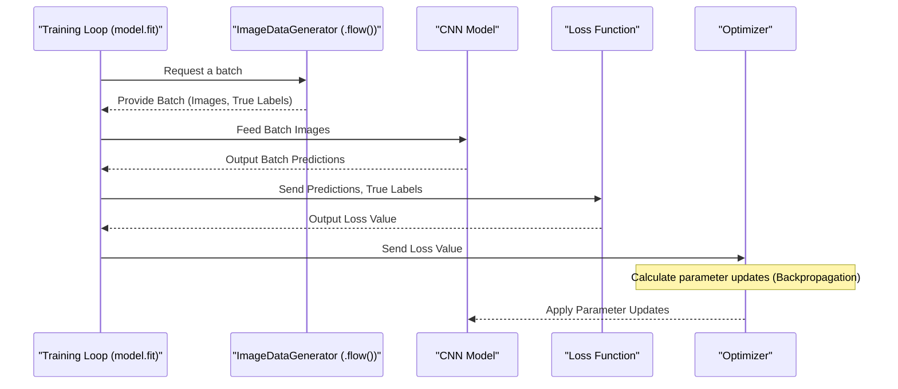

# Chapter 8: Model Training Process

Welcome back! In the last chapter, [Convolutional Neural Network (CNN) Model](07_convolutional_neural_network__cnn__model_.md), we successfully built the "brain" of our traffic sign classification system – a Convolutional Neural Network (CNN). We defined its structure, stacking layers like convolutional and pooling layers that are great at finding patterns in images.

But defining the model is only the first step. Right now, our CNN is like a brand new student who has never seen a traffic sign in their life. It has the structure to learn, but it doesn't know *what* features correspond to a "Stop" sign versus a "Speed Limit" sign.

This is where the **Model Training Process** comes in!

## What is the Model Training Process?

The Model Training Process is the crucial phase where our CNN model actually *learns* to classify traffic signs. Using the prepared [Traffic Sign Data](01_traffic_sign_data_.md) (specifically the [Training Set](05_dataset_splitter_.md)), the model goes through a process of looking at images, making guesses about their labels, checking how wrong its guesses were, and then adjusting itself slightly to get better the next time.

Think back to our student analogy. If the student is learning traffic signs, they would:

1.  Look at a picture of a sign (e.g., a stop sign).
2.  Guess what it is (Maybe they guess "Speed limit 30").
3.  Get feedback: The teacher says, "No, that's a Stop sign."
4.  The student learns from this mistake and adjusts their understanding. Next time they see a similar shape, they'll be less likely to guess "Speed limit 30".
5.  Repeat this process with thousands of different examples, gradually getting better at recognizing all the signs.

Our CNN model does exactly this, but with numbers and mathematical adjustments.

## Key Concepts in Training

Before we look at the code, let's understand the essential ideas:

*   **Epoch:** An epoch is one complete cycle through the *entire* training dataset. If you have 100 training images, one epoch means the model has seen and learned from all 100 images once. Training typically involves many epochs (e.g., 10, 20, 50, or more) because the model needs to see the data multiple times to learn effectively.
*   **Batch Size:** We don't usually show the model one image at a time. Instead, we feed it images in small groups called batches. The model calculates its error and updates its parameters after processing each batch. This makes training more efficient and stable. The [Image Data Generator](06_image_data_generator_.md) provides these batches of potentially augmented images.
*   **Loss Function:** This is like the teacher's feedback. It's a mathematical function that calculates *how wrong* the model's prediction was for a given image (or batch of images). A high loss means the model was very wrong; a low loss means it was close to the correct answer. The goal of training is to minimize this loss. For our classification task with multiple classes, we use `categorical_crossentropy`.
*   **Optimizer:** This is the mechanism the model uses to adjust its internal parameters (the weights and biases in its layers) based on the loss calculated by the loss function. It's like the student figuring out *how* to adjust their understanding after getting feedback. Optimizers use algorithms (like Adam, SGD, etc.) to find the best direction and size of adjustments to quickly reduce the loss. Our project uses the Adam optimizer.
*   **Metrics:** These are measures we use to monitor the model's performance during training. Loss tells us how much error there is, but metrics tell us things we understand more intuitively, like **Accuracy**. Accuracy is the percentage of images the model classified correctly. We want loss to go down and accuracy to go up during training.
*   **Validation Data:** As we saw in [Dataset Splitter](05_dataset_splitter_.md), we set aside a validation set. During training, after each epoch (or a set number of batches), we test the model on this validation set. This gives us an idea of how well the model is performing on data it hasn't *trained* on. If the training accuracy keeps improving, but the validation accuracy stops improving or starts getting worse, it's a strong sign of [Overfitting](06_image_data_generator_.md).

## Setting Up for Training: Compiling the Model

Before training can begin, we need to configure the model for the learning process. This is done using the `compile()` method we briefly saw in the [CNN Model](07_convolutional_neural_network__cnn__model_.md) chapter.

```python
from keras.optimizers import Adam
from keras.models import Sequential # Assuming myModel() returns a Sequential model

def myModel():
    # ... (layers definition as in Chapter 7) ...
    model= Sequential() # Just creating a dummy model for the snippet
    # Add some placeholder layers to make it runnable
    model.add((Conv2D(10,(3,3),input_shape=(32,32,1),activation='relu')))
    model.add(Flatten())
    model.add(Dense(43,activation='softmax'))


    # noOfClasses = 43 # Assuming this is defined earlier
    lr = 0.001 # Learning rate

    # 1. Compile the model
    model.compile(optimizer=Adam(lr=lr),
                  loss='categorical_crossentropy',
                  metrics=['accuracy']) # What metrics to track during training

    return model

model = myModel() # Create an instance of our model
```

**Explanation:**

*   `model.compile(...)`: This method prepares the model for training.
*   `optimizer=Adam(lr=lr)`: We specify which optimizer to use (Adam) and set its learning rate (`lr`). The learning rate controls how big of a step the optimizer takes when adjusting parameters. A common starting value is 0.001.
*   `loss='categorical_crossentropy'`: We tell the model to use this specific loss function, which is standard for classification problems where each item belongs to one of many categories (our 43 traffic signs).
*   `metrics=['accuracy']`: We instruct the model to calculate and report the accuracy metric during training, in addition to the loss.

After calling `compile()`, the model is ready to learn.

## The Core Training Step: `model.fit()`

With the model compiled and our data ready (especially the `dataGen.flow()` generator created in [Image Data Generator](06_image_data_generator_.md)), we can start the training process using the `model.fit()` method.

```python
# Assuming:
# model = myModel() was called
# dataGen = ImageDataGenerator(...) was set up
# X_train, y_train, X_validation, y_validation are ready
# batch_size_val = 32
# epochs_val = 10

# Get the training generator
batches = dataGen.flow(X_train, y_train, batch_size=batch_size_val)

# Calculate steps per epoch (number of batches per epoch)
# len(X_train) is the total number of training images
# // batch_size_val gives the integer number of batches needed
steps_per_epoch = len(X_train) // batch_size_val # In the notebook, this is len(X_train)//32

# 2. Start the training!
history = model.fit(batches, # Provide the data generator for training
                    steps_per_epoch=steps_per_epoch, # How many batches make up one epoch
                    epochs=epochs_val, # How many complete cycles through the data
                    validation_data=(X_validation, y_validation), # Use the validation set to monitor performance
                    shuffle=1) # Shuffle the data each epoch (done by the generator here)
```

**Explanation:**

*   `model.fit(...)`: This is the main function call that starts the training loop.
*   `batches`: We pass our `ImageDataGenerator.flow()` object here. This tells `fit` to get its training data from the generator, which will provide batches of augmented images and their corresponding labels.
*   `steps_per_epoch=steps_per_epoch`: Since we are using a generator, we need to manually tell the `fit` function how many batches constitute one epoch. This is usually the total number of training images divided by the batch size.
*   `epochs=epochs_val`: We specify how many times the model should go through the entire training dataset (in batches). `epochs_val` is set to 10 in the notebook, meaning training will run for 10 cycles.
*   `validation_data=(X_validation, y_validation)`: We provide the separate validation set. After each epoch, Keras will automatically evaluate the model on this data and report the validation loss and validation accuracy (`val_loss`, `val_accuracy`). This is crucial for monitoring overfitting.
*   `shuffle=1`: Although the `ImageDataGenerator` shuffles the data internally, passing `shuffle=True` (or 1) ensures the order of batches might be shuffled further if not handled by the generator itself.

When you run this code, you will see output printed to the console after each epoch, showing the progress.

## Understanding the Training Output

The output you saw in the notebook during the training phase looked like this:

```
Epoch 1/10
695/695 [==============================] - 141s 202ms/step - loss: 2.5258 - accuracy: 0.2969 - val_loss: 0.9100 - val_accuracy: 0.7204
Epoch 2/10
695/695 [==============================] - 114s 164ms/step - loss: 1.2834 - accuracy: 0.6061 - val_loss: 0.3512 - val_accuracy: 0.9023
... (more epochs) ...
Epoch 10/10
695/695 [==============================] - 109s 157ms/step - loss: 0.3262 - accuracy: 0.8992 - val_loss: 0.0583 - val_accuracy: 0.9817
```

Let's break down a single line (Epoch 1):

`Epoch 1/10`
*   This indicates it's the first epoch out of the planned 10.

`695/695 [==============================]`
*   `695`: This is the number of steps (batches) processed in this epoch. It matches the `steps_per_epoch` we calculated (`22271 training images / 32 batch size ≈ 695.9`, rounded down to 695).

`- 141s 202ms/step`:
*   Shows the time taken for the epoch (141 seconds) and the average time per step/batch (202 milliseconds).

`- loss: 2.5258 - accuracy: 0.2969`:
*   `loss`: This is the average loss on the **training** data for this epoch. A high loss like 2.5258 in the first epoch means the model's predictions were very wrong initially.
*   `accuracy`: This is the average accuracy on the **training** data for this epoch (29.69%). Only about 30% of the training images were classified correctly in the first pass.

`- val_loss: 0.9100 - val_accuracy: 0.7204`:
*   `val_loss`: This is the loss calculated on the separate **validation** data *after* the epoch finished. It's lower than the training loss (0.9100 vs 2.5258), indicating the model is already learning something useful that generalizes beyond the exact training examples.
*   `val_accuracy`: This is the accuracy on the **validation** data (72.04%). This tells us the model correctly classified over 72% of the images in the validation set after one epoch.

**Observing the output across epochs:**

Notice how the `loss` (training loss) and `val_loss` (validation loss) generally decrease from Epoch 1 to Epoch 10. This shows the model is successfully learning and reducing its error.

Also, notice how `accuracy` (training accuracy) and `val_accuracy` (validation accuracy) generally increase. By Epoch 10, the training accuracy is almost 90% (0.8992), and the validation accuracy is over 98% (0.9817)! This indicates that the training process was successful in teaching the model to classify traffic signs very accurately on both the training data *and* unseen validation data.

## How it Works Under the Hood (One Training Step)

Let's visualize what happens during a single step (one batch) of training when `model.fit()` is running:



This diagram shows the cycle: the training loop gets data from the generator, feeds it to the model, gets predictions, calculates the error (loss), and then uses the optimizer to adjust the model's parameters based on that error before requesting the next batch. This cycle repeats for thousands of batches over many epochs.

## Visualizing Training Progress: The Plots

The notebook includes code to plot the training and validation loss and accuracy over the epochs. This is a standard practice to visually monitor training progress and identify potential issues like overfitting.

```python
import matplotlib.pyplot as plt # Used for plotting

# Assuming 'history' variable holds the result of model.fit()

plt.figure(1) # Create the first plot
plt.plot(history.history['loss']) # Plot training loss over epochs
plt.plot(history.history['val_loss']) # Plot validation loss over epochs
plt.legend(['training','validation']) # Add a legend to identify lines
plt.title('loss') # Set the title
plt.xlabel('epoch') # Label the x-axis

plt.figure(2) # Create the second plot
plt.plot(history.history['accuracy']) # Plot training accuracy over epochs
plt.plot(history.history['val_accuracy']) # Plot validation accuracy over epochs
plt.legend(['training','validation'])
plt.title('Acurracy')
plt.xlabel('epoch')

plt.show() # Display the plots
```

The plots you saw in the notebook are generated by this code:

*   **Loss Plot:** Shows the training loss and validation loss curves. Ideally, both should decrease over epochs. If the training loss keeps dropping but validation loss starts increasing, it means the model is overfitting.
*   **Accuracy Plot:** Shows the training accuracy and validation accuracy curves. Ideally, both should increase over epochs and stay close together. If training accuracy keeps rising but validation accuracy plateaus or drops, it's overfitting.

Our plots showed both loss curves decreasing and both accuracy curves increasing, with the validation accuracy even slightly higher than training accuracy towards the end. This is a good sign that the model learned effectively and generalized well, likely due to the data augmentation provided by the [Image Data Generator](06_image_data_generator_.md) and the dropout layers in the [CNN Model](07_convolutional_neural_network__cnn__model_.md).

## Saving the Trained Model

After training is complete, we have a model with learned parameters (weights and biases) that can now classify traffic signs. We want to save this trained model so we can use it later without having to retrain it every time.

```python
# After training is complete
model.save("model.h5") # Save the model to a file named "model.h5"
```

**Explanation:** The `model.save()` method saves the model's architecture, weights, and the training configuration (optimizer, loss, etc.) into a single file (in HDF5 format, hence the `.h5` extension). This file `model.h5` can be loaded later in a different script or application to make predictions on new images.

## Why is This Step Important?

The Model Training Process is arguably the most important step because it's where the machine learning actually happens. Without training, the CNN model is just an empty shell. By repeatedly showing it data, calculating errors, and adjusting its parameters, we enable it to learn the complex patterns needed to distinguish between different traffic signs. The output of this process is a trained model capable of performing the core task of our system.

## Conclusion

In this chapter, we delved into the **Model Training Process**. We understood that this is the phase where our CNN model learns from the [Training Set](05_dataset_splitter_.md), using concepts like epochs, batches, loss functions, and optimizers. We saw how the `model.compile()` function prepares the model for learning and the `model.fit()` function executes the training loop, utilizing the [Image Data Generator](06_image_data_generator_.md) and monitoring performance on the [Validation Set](05_dataset_splitter_.md). We learned to interpret the training output and visualize progress with plots. Finally, we saw how to save the resulting trained model for future use.

Now that we have a trained model, the final step is to rigorously test its performance on the completely unseen [Test Set](05_dataset_splitter_.md) to get an unbiased evaluation of how well it will perform in practice.

Ready to see how well our trained model performs? Let's move on to the next chapter!

[Model Evaluation Process](09_model_evaluation_process_.md)

---
