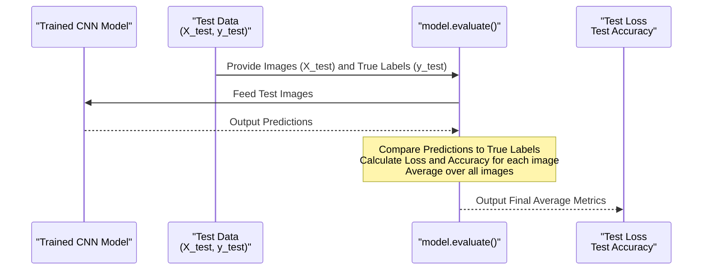

# Chapter 9: Model Evaluation Process

Welcome back! We've arrived at a crucial milestone in our journey. In the last chapter, [Model Training Process](08_model_training_process_.md), we took our [Convolutional Neural Network (CNN) Model](07_convolutional_neural_network__cnn__model_.md) and trained it using our prepared training data and the [Image Data Generator](06_image_data_generator_.md). We watched the loss go down and accuracy go up on both the training and validation sets, which was a great sign that the model was learning.

But remember our student analogy? We gave the student study material (training data) and practice tests (validation data). Now, to truly see how well they've mastered the subject *on new questions*, we need to give them a final exam!

This is exactly what the **Model Evaluation Process** is for.

## What is the Model Evaluation Process?

The Model Evaluation Process is the step where we measure the performance of our *trained* model on data it has **never seen before** – our dedicated [Test Set](05_dataset_splitter_.md).

Why is this so important?

*   The training data is what the model learned from. High accuracy on this set might just mean it memorized the answers (overfitting).
*   The validation data was used during training to help us tune the model and check for overfitting *while learning*.
*   The **test set** is the *only* set that was completely hidden throughout the entire learning and tuning process. Evaluating on this set gives us the most realistic and unbiased estimate of how well our model will perform on **real-world traffic sign images** when it's deployed.

It's the final, independent assessment of our model's capabilities.

## How the System Evaluates the Model

After the model has finished its epochs of training, the project uses a simple function provided by Keras (`model.evaluate()`) to run this final test.

This function takes the test images (`X_test`) and their true labels (`y_test`), feeds the images through the *trained* model, gets the model's predictions, and then calculates the loss and metrics (like accuracy) based on how close the predictions were to the true labels in the test set.

Let's look at the code snippet from the notebook that performs this evaluation:

```python
# Assuming:
# model is the trained model from the previous chapter
# X_test, y_test are the test set images and labels from the Dataset Splitter

# Perform the evaluation on the test set
score = model.evaluate(X_test, y_test, verbose=0)

# The 'score' variable now holds the evaluation results
```

**Explanation:**

*   `model.evaluate(X_test, y_test, verbose=0)`: This is the function call that starts the evaluation.
    *   `X_test`: The NumPy array containing all the images in our test set.
    *   `y_test`: The NumPy array containing the true labels for the images in `X_test`.
    *   `verbose=0`: This parameter controls how much output is printed during the evaluation. `0` means no progress bar or verbose output; it just runs quietly.
*   `score = ...`: The `evaluate` function returns a list of values. The order corresponds to the metrics specified when we compiled the model (in [Model Training Process](08_model_training_process_.md)). Since we compiled with `loss` and `accuracy`, `score` will be a list like `[test_loss, test_accuracy]`.

## Looking at the Evaluation Results

After the `model.evaluate()` function finishes, the `score` variable holds the results. The code then prints these results:

```python
# Assuming 'score' variable contains the results from model.evaluate()

# Print the test loss (the first value in the score list)
print('Test Score:', score[0])

# Print the test accuracy (the second value in the score list)
print('Test Accuracy:', score[1])
```

The output you saw in the notebook for this step was:

```
Test Score: 0.04966879263520241
Test Accuracy: 0.9850574731826782
```

**Explanation:**

*   `Test Score: 0.04966879263520241`: This is the average **loss** calculated on the test set. A low loss value (like 0.049) indicates that the model's predictions on the test data were generally very close to the true labels.
*   `Test Accuracy: 0.9850574731826782`: This is the **accuracy** on the test set. It means that the model correctly classified approximately **98.51%** of the images in the test set! This is a very high accuracy, indicating our trained model is performing exceptionally well on traffic sign images it has never encountered before.

This high test accuracy confirms that our model didn't just memorize the training data; it learned generalizable features that allow it to correctly identify new traffic signs.

## How it Works Under the Hood (Conceptual)

When you call `model.evaluate()`, Keras performs the following steps internally:

1.  **Load Test Data:** It takes the `X_test` images and `y_test` true labels.
2.  **Forward Pass:** For each image in `X_test`, it feeds it through the entire trained CNN model, layer by layer, to get a prediction (a set of probabilities for each of the 43 classes). This is the "forward pass" or inference step, just like when the model makes predictions in the real world.
3.  **Calculate Loss:** For each prediction, it compares it to the corresponding true label from `y_test` using the loss function (`categorical_crossentropy` in our case) to calculate how "wrong" the prediction was.
4.  **Calculate Metrics:** It also calculates the specified metrics (like accuracy) by comparing the predicted class (the one with the highest probability) to the true label.
5.  **Average Results:** It averages the loss and metrics across all the images in the test set.
6.  **Return Score:** It returns these final average values (test loss and test accuracy).

Crucially, during evaluation, the model's internal parameters (weights and biases) are **not** updated. The evaluation process is purely a measurement step.

Here's a simple diagram showing the process for the entire test set:



This diagram shows that the evaluation process uses the test data, runs it through the fixed, trained model, and calculates the final performance scores.

## Why is This Step Important?

The Model Evaluation Process is the ultimate sanity check for our system. Training and validation metrics are useful, but the test set performance is the most reliable indicator of how well the model will actually work when classifying new, real traffic signs.

A high accuracy on the test set (like the 98.5% we achieved) gives us confidence that the model is robust and can be trusted to make accurate predictions in a practical application. If the test accuracy were significantly lower than the validation accuracy, it would indicate overfitting or issues with the data split, requiring further investigation and potentially changes to the model or training process.

## Conclusion

In this chapter, we completed the core process of building and validating our traffic sign classification model. We focused on the crucial **Model Evaluation Process**, understanding that it involves testing our *trained* model on a completely unseen [Test Set](05_dataset_splitter_.md). We saw how the `model.evaluate()` function performs this task and how the resulting test loss and test accuracy provide an unbiased measure of the model's real-world performance. The high accuracy achieved on the test set is a strong indication that our system is capable of accurately classifying a wide variety of traffic signs.

This marks the end of the tutorial chapters covering the fundamental steps of data handling, model building, training, and evaluation for the traffic sign classification system. You now understand the purpose of each major component and how they work together.

---
