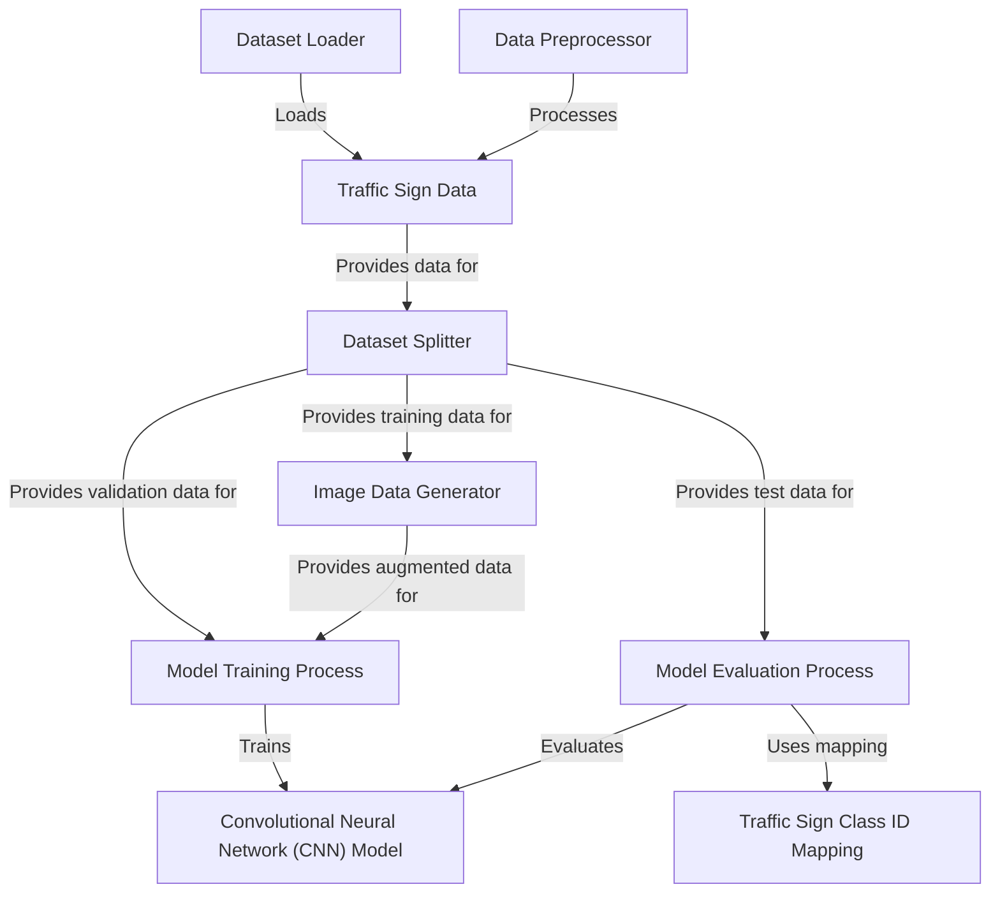

# Tutorial: Traffic-Sign-Classification-System-

This project is a **Traffic Sign Classification System** that uses **deep learning** to automatically
*recognize* different types of traffic signs from images. It involves loading images,
preparing them, training a **Convolutional Neural Network (CNN)** model to understand
the signs, and then testing how well the model works.

## Visual Overview

## Chapters

1. [Traffic Sign Data
](01_traffic_sign_data_.md)
2. [Traffic Sign Class ID Mapping
](02_traffic_sign_class_id_mapping_.md)
3. [Dataset Loader
](03_dataset_loader_.md)
4. [Data Preprocessor
](04_data_preprocessor_.md)
5. [Dataset Splitter
](05_dataset_splitter_.md)
6. [Image Data Generator
](06_image_data_generator_.md)
7. [Convolutional Neural Network (CNN) Model
](07_convolutional_neural_network__cnn__model_.md)
8. [Model Training Process
](08_model_training_process_.md)
9. [Model Evaluation Process
](09_model_evaluation_process_.md)

---
